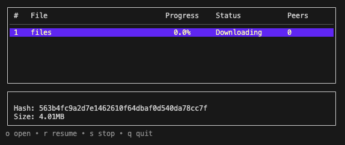

# gtorrent

A BitTorrent client written in Go as a learning project.
The goal is to build a clean, idiomatic code-base that covers the *core* of the BitTorrent protocol (BEP 3).

---

---

## ✨ Current features

| Area | Status | Notes |
|------|--------|-------|
| `.torrent` parsing | ✔️ | Single- & multi-file support |
| SHA-1 piece verification | ✔️ | Uses Go’s std-lib `crypto/sha1` |
| TCP handshake & messaging | ✔️ | Choke/Unchoke, Interested, Request, Piece… |
| Tracker (HTTP) announce | ✔️ | Sends *started*, periodic *updated*, *stopped* |
| Piece scheduler | ✔️ | Sequential for now |
| Storage layer | ✔️ | Multi-file, resume capable |
| Connection manager | ✔️ | Limits concurrent peers |
| CLI / TUI (Bubble Tea) | ⚙️ | Basic torrent list & progress table |

---

## 🛠️ Roadmap / TODO

* **Piece-selection strategies** – rarest-first, end-game.
* **UDP tracker support**.
* **DHT & peer exchange** (BEP 5 / BEP 11).
* **Upload rate limiting** and ratio goals.
* **Magnet URI support**.
* **Better TUI** – per-peer view, file priority picker.
* **Configuration & persistence** – .ini / YAML + resume data file.
* **Cross-platform builds** with `make release`.

---

## Quick start

```bash
# clone & build
git clone https://github.com/danferreira/gtorrent
cd gtorrent
go build ./cmd/gtorrent-tui

# open terminal interface
./gtorrent-tui
